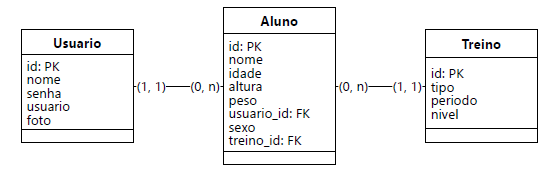

# GenFit

GenFit - Sistema de Gerenciamento de treinos para alunos
O projeto Fitness da GenFit  é focado em oferecer um sistema de gerenciamento de treinos para alunos de academias. Com funcionalidades básicas de cadastro e organização de seus respectivos treinos e o cálculo do IMC do aluno cadastrado, o sistema permitirá gerenciar os dados do usuário, criando, lendo, atualizando  e excluindo. 


- DER Gen fit



## <a href="https://docs.google.com/document/d/10A2NHIvu8KOkq30UwUPa4Wu0mm6fnEemDds4KOy_UsQ/edit?tab=t.0">Escopo do Projeto</a>

## 🛠️ Principais Funcionalidades
1. **Alunos**:
   - Criar, listar, atualizar, Lista por IMC, e excluir alunos.
   - Filtrar Alunos por nome, ID ou departamento.

2. **Treinos**:
   - Criar, listar, atualizar e excluir treinos.
   - Filtrar treinos por nome ou ID.

---

## 🛠️ Tecnologias Utilizadas
- **Backend**: Java com Spring Boot
  - Spring Data JPA
  - Spring Web
  - Spring Validation
  - Security
  - Jwt
  - MySQL Driver
- **Banco de Dados**: MySQL
- **Ferramenta de Build**: Maven

---

## 📋 Pré-Requisitos
Para executar o projeto, você precisará de:
- **Java 17** ou superior instalado.
- **MySQL** instalado e configurado.
- **Maven** instalado para gerenciar dependências.

---

## Estruturas de Pastas

```
src/
├── main/
|   ├── controller/
|   │   ├── AlunoController.java
|   |   ├── TreinoController.java
|   |   ├── UsuarioController.java
|   ├── model/
|   │   ├── Aluno.java
|   │   ├── Treino.java
|   |   ├── Usuario.java
|   |   ├── UsuarioLogin.java
|   ├── repository/
|   │   ├── AlunoRepository.java
|   │   ├── TreinoRepository.java
|   |   ├── UsuarioRepository.java
|   ├── security/
|   │   ├── BasicSecurityConfig.java
|   │   ├── JwtAuthFilter.java
|   |   ├── JwtService.java
|   │   ├── UserDetailsImpl.java
|   │   ├── UserDetailsServiceImpl.java
|   ├── service/
|   │   ├── AlunoService.java
|   │   ├── UsuarioService.java
```

